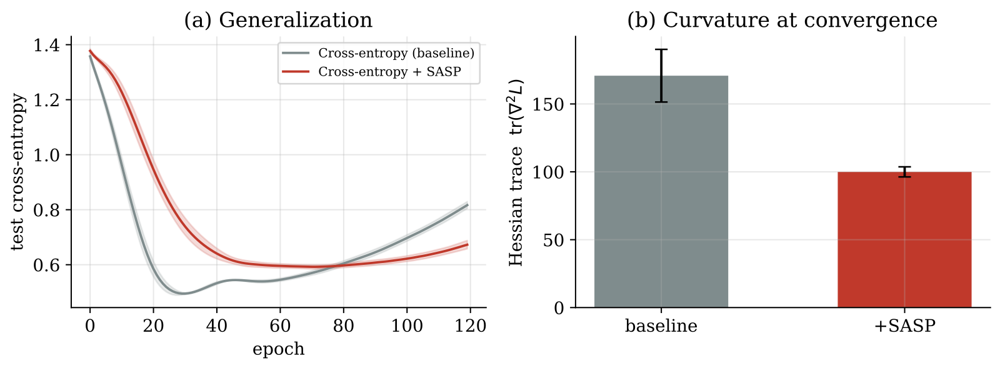
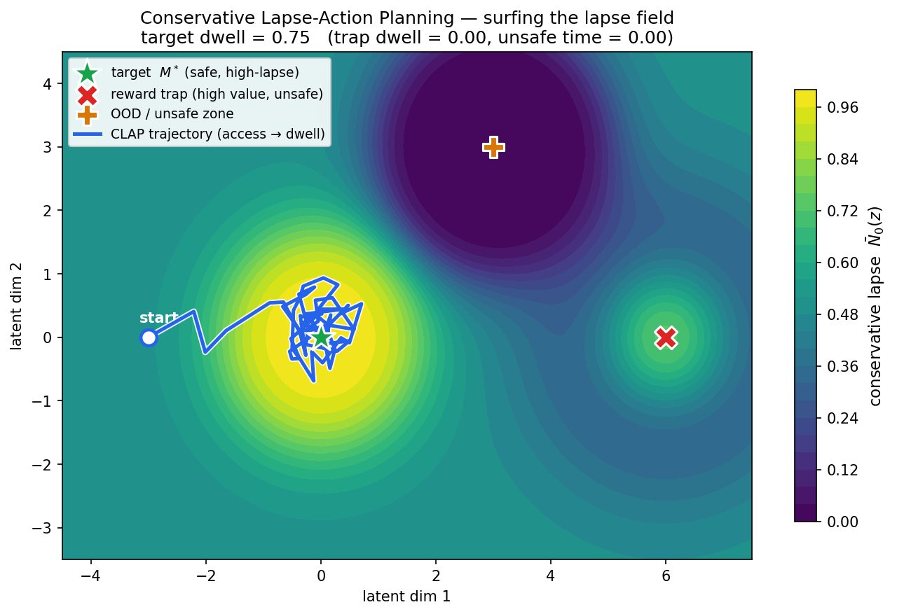

<!--
  Profile README for github.com/MrRobotop
  The block between the STATS markers is rewritten every day by .github/workflows/refresh-stats.yml.
  Everything else is yours to edit.
-->

<picture>
  <source media="(prefers-color-scheme: dark)" srcset="assets/banner-dark.svg">
  
</picture>

  
  
  
  
  

I build AI systems that have to be right: evaluation for LLM agents, evidence-based claim verification, safe planning in learned latent spaces, and machine learning for markets. As co-founder and CEO of [Valuren](https://www.linkedin.com/company/valuren/), I give fashion and luxury brands digital product passports: verified authenticity, ownership history and royalties on resale. Based in London.

<!-- STATS:START -->
<picture>
  <source media="(prefers-color-scheme: dark)" srcset="assets/stats-dark.svg">
  
</picture>

Stats as a table

| Metric | Value |
| :-- | :-- |
| Hugging Face downloads, all time | 2,792 (VeriSci models 2,129 · SchemaSage models 403 · Datasets 260) |
| Hugging Face downloads, last 30 days | 309 |
| Models, datasets, Spaces | 28, 1, 2 |
| GitHub stars | 71 across 69 public repos |
| PyPI downloads, excluding mirrors | 491 (toploss 223 · clap-family 268) |
| Preprints | 4 (2026, on Zenodo) |

Updated 9 Oct 2026; refreshed daily by GitHub Actions.

<!-- STATS:END -->

## LLM systems

### VeriSci: scientific claim verification

<a href="https://huggingface.co/spaces/rishhh/verisci-claim-space"><picture><source media="(prefers-color-scheme: dark)" srcset="https://huggingface.co/datasets/huggingface/badges/resolve/main/open-in-hf-spaces-sm-dark.svg"></picture></a>

Paste a scientific claim and VeriSci answers SUPPORTS, REFUTES or NOT ENOUGH INFO, with the sentences that justify the label. The Hub holds the retriever, the release verifier and the seeded ablations of evidence selection behind it.

<picture>
  <source media="(prefers-color-scheme: dark)" srcset="assets/verisci-dark.svg">
  
</picture>

### SchemaSage-SQL: safe text-to-SQL

<a href="https://huggingface.co/rishhh/schemasage-sql-qwen3-4b-clean-balanced-200"><picture><source media="(prefers-color-scheme: dark)" srcset="https://huggingface.co/datasets/huggingface/badges/resolve/main/model-on-hf-sm-dark.svg"></picture></a>
<a href="https://huggingface.co/datasets/rishhh/schemasage-sql-clean-text2sql"><picture><source media="(prefers-color-scheme: dark)" srcset="https://huggingface.co/datasets/huggingface/badges/resolve/main/dataset-on-hf-sm-dark.svg"></picture></a>

QLoRA adapters on Qwen3-4B that turn questions into read-only SQL grounded in the schema you pass in, with a safety layer that refuses destructive requests. A larger 8,192-row run scored higher on exact match and execution accuracy but missed one blocked refusal, so the smaller adapter shipped.

<picture>
  <source media="(prefers-color-scheme: dark)" srcset="assets/schemasage-dark.svg">
  
</picture>

### Evaluation and agent tooling

**[ariadne-eval](https://github.com/MrRobotop/ariadne-eval)** &nbsp;   
Trajectory-level tracing and scoring for multi-step, tool-using agents, so behaviour regressions show up before production.

**[evalforge](https://github.com/MrRobotop/evalforge)** &nbsp;  
LLM evaluation for text-to-SQL and code: bootstrapped confidence intervals, calibrated LLM-as-judge, cost and latency Pareto fronts, and a CI gate that comments on every pull request.

**[financeMCPSuite](https://github.com/MrRobotop/financeMCPSuite)** and **[ml-intern-mcp-toolkit](https://github.com/MrRobotop/ml-intern-mcp-toolkit)** &nbsp;  
MCP servers: strategy, P&L and risk data for Claude; full-text arXiv reading and an experiment tracker for an autonomous ML agent.

## Research that ships

Each library pairs installable code with a first-author preprint.

### toploss

Five optimiser-free PyTorch regularisers that rebuild SAM, cautious weight decay, AdEMAMix and other recent optimiser ideas as loss penalties, so plain SGD or Adam gets their effect.

SASP, three seeds on CPU: Hessian trace at convergence down 41% (170.8 to 100.0) and test cross-entropy down 18%, at +15% wall-clock against +107% for SAM.

### clap-family

Conservative Lapse-Action Planning: reach the best safe region of a latent space, then stay there. Differentiable PyTorch adapters and seven planner variants.

In a 2-D latent field the planner reaches the safe target and dwells there (dwell 0.75), with zero time in the reward trap or the out-of-distribution zone.

### micro-world-model

Hierarchical JEPA world model that plans in a 256-dimensional latent space with no reconstruction, no reward and no EMA target. Trained on about 49,000 sequences for 300 epochs.

## Quant systems

| Project | What it does | Built with |
| :-- | :-- | :-- |
| [**hft-market-data-processor**](https://github.com/MrRobotop/hft-market-data-processor) | Rust market-data engine with lock-free queues, benchmarked at 4M+ ticks per second with sub-microsecond latency |  |
| [**statistical-arb-timesfm**](https://github.com/MrRobotop/statistical-arb-timesfm) | Pairs trading with Kalman-filter hedge ratios and TimesFM 2.5 forecasts, served through FastAPI to a React dashboard |   |
| [**timesfm-risk-engine**](https://github.com/MrRobotop/timesfm-risk-engine) | Value-at-Risk and stress testing on TimesFM 2.5 |  |

## Selected papers

- **Topological Loss Engineering:** Embedding Optimizer-Side Geometric Constraints Directly Into the Objective Function. Zenodo, 2026. [doi:10.5281/zenodo.20497841](https://doi.org/10.5281/zenodo.20497841)
- **Conservative Lapse-Action Planning:** A Variational Access-and-Dwell Framework for Safe Latent Trajectory Optimization. Zenodo, 2026. [doi:10.5281/zenodo.20467271](https://doi.org/10.5281/zenodo.20467271)
- **Micro-World Models:** Energy-Based Hierarchical Joint-Embedding Predictive Architectures for Continuous Kinematic Planning. Zenodo, 2026. [doi:10.5281/zenodo.20480620](https://doi.org/10.5281/zenodo.20480620)
- **Accelerated Machine Learning with Dependent Types.** MSc dissertation, University of St Andrews, 2025, supervised by Dr Edwin Brady. [Summary](https://www.rishabhpatil.com/research/ml-dependent-types)

Full list on [ORCID](https://orcid.org/0009-0007-0868-9673).

## Toolbox

            

## Background

MSc Artificial Intelligence, University of St Andrews. BSc Artificial Intelligence, VU Amsterdam. Before Valuren I co-founded RelAIable, an AI consultancy in Amsterdam, as Chief AI Officer.

Happy to talk about digital product passports, LLM evaluation or world models: [rishabh.a.patil@outlook.com](mailto:rishabh.a.patil@outlook.com)

Badges are live. The stats card refreshes daily through GitHub Actions.
